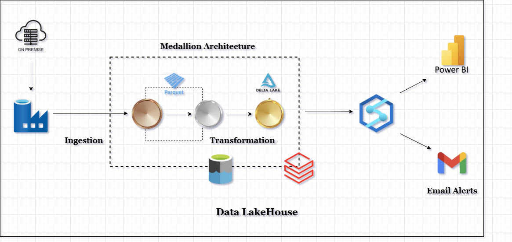

# BI Project Course

## Overview
This project demonstrates an end to end Business Intelligence pipeline built on a Medallion Architecture using Databricks and Power BI. The pipeline ingests raw operational data, transforms it through Bronze, Silver, and Gold layers, and exposes curated analytical datasets for reporting.

The objective of the project is to show how raw data can be processed into clean, trusted, and analytics ready data.

## Architecture
The overall system architecture is shown below.



The pipeline follows the Medallion Architecture pattern:
- Bronze layer stores raw ingested data.
- Silver layer contains cleaned and standardized data.
- Gold layer contains business curated, analytics ready datasets.

Transformations are executed using PySpark notebooks on Databricks. The curated data is exposed through SQL views and consumed by Power BI for reporting.

## Project Structure
```
BI_PROJECT_COURSE/
├── dashboard/                    # Power BI dashboard files
│   └── dashboard.pbix
│
├── data_source/                  # Raw data sources and backups
│   └── HRManagement.bak
│
├── pyspark/                      # PySpark notebooks for data transformation
│   ├── bronze_to_silver.ipynb
│   └── silver_to_gold.ipynb
│
├── views_synapse/                # SQL scripts to create analytical views
│   ├── auto_create_view_silver_layer.sql
│   └── auto_create_view_gold_layer.sql
│
├── Architecture.png              # System architecture diagram
├── pipeline_execution_result.pdf # Pipeline execution report
├── README.md                     # Project documentation
└── .gitignore   
```

